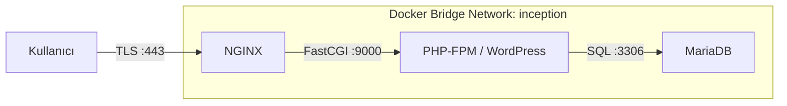

<div align="center">

# Inception: Docker Compose ile NGINX + PHP-FPM (WordPress) + MariaDB

Kıdemli DevOps ve Backend eğitimi — Teori + Pratik + Alternatifler + Troubleshooting

</div>

## İçindekiler

- [Büyük Resim ve Hedefler](#büyük-resim-ve-hedefler)
- [Docker Nedir? (Temelden ileriye)](#docker-nedir-temelden-ileriye)
- [Proje Mimari Diyagramı (metinsel)](#proje-mimari-diyagramı-metinsel)
- [Depo Yapısı ve Ana Dosyalar](#depo-yapısı-ve-ana-dosyalar)
    - [.env Değişkenleri (satır satır açıklama)](#env-değişkenleri-satır-satır-açıklama)### 🌐 NGINX (`requirements/nginx`)

#### Dockerfile Build Stratejisi
```dockerfile
FROM debian:bullseye                    # Temel imaj: Debian 11

# Web Server Stack (Web Sunucu Yığını)
RUN apt-get update && apt-get install -y \
  ## Performans İpuçları

### 🌐 NGINX Optimizasyonları

#### HTTP/2 ve Compression
```nginx
server {
    listen 443 ssl http2;           # HTTP/2'yi etkinleştir
    
    # Gzip sıkıştırma
    gzip on;
    gzip_vary on;
    gzip_min_length 1024;
    gzip_types
        text/plain
        text/css
        text/xml
        text/javascript
        application/javascript
        application/xml+rss
        application/json
        image/svg+xml;
    
    # Brotli (modern tarayıcılar için)
    brotli on;
    brotli_comp_level 6;
    brotli_types text/plain text/css application/json application/javascript;
}
```

#### Static File Caching
```nginx
# Statik dosyaları önbelleğe al
location ~* \.(jpg|jpeg|png|gif|ico|css|js|woff2?)$ {
    expires 1y;
    add_header Cache-Control "public, immutable";
    access_log off;
}

# Security.txt ve robots.txt
location = /robots.txt {
    access_log off;
    log_not_found off;
}
```

#### FastCGI Cache
```nginx
# FastCGI önbellek bölgesi
fastcgi_cache_path /var/cache/nginx levels=1:2 keys_zone=WORDPRESS:100m inactive=60m;

location ~ \.php$ {
    # FastCGI önbelleği
    fastcgi_cache WORDPRESS;
    fastcgi_cache_valid 200 60m;
    fastcgi_cache_key "$scheme$request_method$host$request_uri";
    
    # Giriş yapmış kullanıcılar için önbelleği atla
    fastcgi_cache_bypass $http_cookie;
    fastcgi_no_cache $http_cookie;
}
```

### 🐘 PHP-FPM Tuning

#### Process Manager Hesaplaması
```bash
# Kullanılabilir bellek kontrolü
free -m

# CPU çekirdek sayısı
nproc

# Optimal max_children hesaplaması
# RAM için: (Available RAM * 0.8) / (Average PHP process size)
# CPU için: CPU cores * 2-4

# Örnek: 2GB RAM, 2 CPU core
# PHP process ~50MB average
# max_children = (2048 * 0.8) / 50 = ~32
# CPU constraint: 2 * 4 = 8
# Final: min(32, 8) = 8
```

#### Optimize edilmiş www.conf
```ini
[www]
pm = dynamic
pm.max_children = 8             # Yukarıda hesaplanan değer
pm.start_servers = 2            # max_children'ın %25'i
pm.min_spare_servers = 1        # max_children'ın %12.5'i  
pm.max_spare_servers = 4        # max_children'ın %50'si
pm.max_requests = 1000          # Worker yeniden başlatma (bellek sızıntısı önleme)

# Kaynak sınırları
pm.process_idle_timeout = 30s
request_terminate_timeout = 60s

# Durum sayfası (izleme)
pm.status_path = /php-fpm-status
```

#### PHP INI Optimizasyonları
```ini
# php.ini
memory_limit = 256M             # İşlem başına bellek sınırı
max_execution_time = 300        # Script zaman aşımı
upload_max_filesize = 64M       # Dosya yükleme sınırı
post_max_size = 64M             # POST veri sınırı

# OpCache (PHP bytecode cache - PHP bayt kodu önbelleği)
opcache.enable = 1
opcache.memory_consumption = 128
opcache.interned_strings_buffer = 8
opcache.max_accelerated_files = 4000
opcache.revalidate_freq = 60
opcache.validate_timestamps = 0  # Production: performans için devre dışı bırak
```

### 🗄️ MariaDB Performance Tuning

#### Memory Configuration
```ini
# 50-server.cnf
[mysqld]
# Bellek tahsisi (toplam RAM'in ~%70'i)
innodb_buffer_pool_size = 1G    # En önemli ayar
key_buffer_size = 32M           # MyISAM indeks önbelleği

# Sorgu önbelleği
query_cache_type = 1
query_cache_size = 64M
query_cache_limit = 2M

# Bağlantı ayarları
max_connections = 100
thread_cache_size = 16
table_open_cache = 4000

# InnoDB ayarları
innodb_flush_log_at_trx_commit = 2  # Daha iyi performans, hafif dayanıklılık değişimi
innodb_log_file_size = 256M
innodb_log_buffer_size = 16M
```

#### Slow Query Analysis
```sql
-- Yavaş sorgu günlüğünü etkinleştir
SET GLOBAL slow_query_log = 'ON';
SET GLOBAL long_query_time = 2;

-- WordPress için yararlı indeksler
ALTER TABLE wp_posts ADD INDEX idx_post_name (post_name);
ALTER TABLE wp_posts ADD INDEX idx_post_parent (post_parent);
ALTER TABLE wp_postmeta ADD INDEX idx_meta_key (meta_key);

-- Sorgu analizi
SHOW PROCESSLIST;
EXPLAIN SELECT * FROM wp_posts WHERE post_status = 'publish';
```

#### Performance Monitoring Queries
```sql
-- Tablo boyutları
SELECT 
    table_name AS "Table",
    round(((data_length + index_length) / 1024 / 1024), 2) AS "Size (MB)"
FROM information_schema.TABLES 
WHERE table_schema = "wordpress"
ORDER BY (data_length + index_length) DESC;

-- Sorgu önbelleği isabet oranı
SHOW STATUS LIKE 'Qcache%';
```

### 💾 WordPress Optimizasyonları

#### Object Cache (Redis Integration)
```yaml
# docker-compose.yml'e ekle
redis:
  image: redis:7-alpine
  command: redis-server --maxmemory 256mb --maxmemory-policy allkeys-lru
  networks:
    - inception
```

```php
// wp-config.php
define('WP_REDIS_HOST', 'redis');
define('WP_REDIS_PORT', 6379);
define('WP_CACHE', true);

// Redis object cache plugin
// wp plugin install redis-cache --activate --allow-root
```

#### Performance Plugins
```bash
# WP Super Cache
wp plugin install wp-super-cache --activate --allow-root

# W3 Total Cache (gelişmiş)
wp plugin install w3-total-cache --activate --allow-root

# Görsel optimizasyonu
wp plugin install wp-smushit --activate --allow-root

# Önbellek temizleme
wp cache flush --allow-root
```

#### Database Optimization
```bash
# Veritabanı temizliği
wp plugin install wp-optimize --activate --allow-root

# Manuel optimizasyon
wp db optimize --allow-root
wp db repair --allow-root

# Kullanılmayan verileri kaldır
wp post delete $(wp post list --post_status=trash --format=ids) --force --allow-root
```

### 📊 Container Resource Limits

#### Resource Constraints
```yaml
# docker-compose.yml
services:
  wordpress:
    deploy:
      resources:
        limits:
          cpus: '1.0'           # 1 CPU çekirdeği
          memory: 512M          # 512MB RAM
        reservations:
          cpus: '0.5'           # Minimum 0.5 çekirdek
          memory: 256M          # Minimum 256MB
  
  mariadb:
    deploy:
      resources:
        limits:
          cpus: '1.0'
          memory: 1G
        reservations:
          cpus: '0.5'
          memory: 512M
```

#### Performance Monitoring
```bash
# Gerçek zamanlı kaynak kullanımı
docker stats

# Container'a özel istatistikler
docker exec wordpress cat /proc/meminfo | head -n 5
docker exec wordpress cat /proc/loadavg

# Disk kullanımı
docker system df
docker exec wordpress du -sh /var/www/html

# Ağ trafiği
docker exec nginx cat /proc/net/dev
```

### 🔧 Performance Testing

#### Benchmarking Tools
```bash
# Apache Bench (basit yük testi)
ab -n 1000 -c 10 https://egermen.42.fr/

# Siege (gelişmiş yük testi)
siege -c 20 -t 30s https://egermen.42.fr

# GTmetrix / PageSpeed Insights
# Detaylı performans analizi için çevrimiçi araçlar
```

#### Doğrulama Komutları
```bash
# NGINX config test (NGINX yapılandırma testi)
docker compose -f srcs/docker-compose.yml exec nginx nginx -T | head -n 50

# PHP-FPM status (PHP-FPM durumu)
docker compose -f srcs/docker-compose.yml exec wordpress curl http://localhost:9000/php-fpm-status

# MySQL performance (MySQL performansı)
docker compose -f srcs/docker-compose.yml exec mariadb mysql -e "SHOW STATUS LIKE 'Qcache%';"
```                           # HTTP server
    openssl \                           # SSL/TLS sertifika üretimi
    && apt-get clean \
    && rm -rf /var/lib/apt/lists/*

# Configuration & Scripts (Yapılandırma ve Scriptler)
COPY conf/nginx.conf /etc/nginx/nginx.conf              # Ana yapılandırma
COPY tools/nginx_setup.sh /usr/local/bin/nginx_setup.sh
RUN chmod +x /usr/local/bin/nginx_setup.sh

# Runtime Directories (Çalışma zamanı dizinleri)
RUN mkdir -p /etc/nginx/ssl \           # SSL sertifikaları
    && mkdir -p /var/www/html \         # Belge kök dizini
    && chown -R www-data:www-data /var/www/html

EXPOSE 443                              # HTTPS portu
ENTRYPOINT ["/usr/local/bin/nginx_setup.sh"]
```

#### NGINX Setup ve SSL Yönetimi
```
nginx_setup.sh Execution Flow:
┌─────────────────┐
│ 1. Domain       │ → sed -i "s/DOMAIN_NAME_PLACEHOLDER/$DOMAIN_NAME/g" \
│   Substitution  │     /etc/nginx/nginx.conf
└─────────┬───────┘
          ▼
┌─────────────────┐
│ 2. SSL Check    │ → if [ ! -f /etc/nginx/ssl/inception.crt ]; then
└─────────┬───────┘
          ▼
┌─────────────────┐
│ 3. Generate     │ → openssl req -x509 -nodes \
│   Certificate   │     -out /etc/nginx/ssl/inception.crt \
│                 │     -keyout /etc/nginx/ssl/inception.key \
│                 │     -subj "/C=TR/ST=Istanbul/L=Istanbul/O=42/OU=42/CN=$DOMAIN_NAME"
└─────────┬───────┘
          ▼
┌─────────────────┐
│ 4. Config Test  │ → nginx -t  (syntax validation)
└─────────┬───────┘
          ▼
┌─────────────────┐
│ 5. Start NGINX  │ → exec nginx -g "daemon off;"
│   (Foreground)  │
└─────────────────┘
```

#### NGINX Konfigürasyon Anatomisi (`conf/nginx.conf`)
```nginx
user www-data;                          # Worker process kullanıcısı
worker_processes auto;                  # CPU çekirdeklerini otomatik algıla
pid /run/nginx.pid;                     # Process ID dosyası

events {
    worker_connections 1024;            # Worker başına maksimum bağlantı
}

http {
    # MIME Types & Basic Settings (MIME Türleri ve Temel Ayarlar)
    include /etc/nginx/mime.types;
    default_type application/octet-stream;
    sendfile on;                        # Verimli dosya sunumu
    tcp_nopush on;                      # Ağ paketlerini optimize et
    keepalive_timeout 65;               # Bağlantı yeniden kullanımı
    server_tokens off;                  # NGINX sürümünü gizle (güvenlik)

    # SSL/TLS Configuration (SSL/TLS Yapılandırması)
    ssl_protocols TLSv1.2 TLSv1.3;      # Sadece modern TLS
    ssl_prefer_server_ciphers on;       # Sunucu şifre tercihi
    
    # Compression (Sıkıştırma)
    gzip on;                            # Sıkıştırmayı etkinleştir

    server {
        # HTTPS Listener (HTTPS Dinleyicisi)
        listen 443 ssl http2;           # TLS + HTTP/2
        listen [::]:443 ssl http2;      # IPv6 desteği
        
        server_name DOMAIN_NAME_PLACEHOLDER;  # Çalışma zamanı değişimi
        
        # SSL Certificates (self-signed) (SSL Sertifikaları - kendi imzalı)
        ssl_certificate /etc/nginx/ssl/inception.crt;
        ssl_certificate_key /etc/nginx/ssl/inception.key;
        
        # Document Root (Belge Kök Dizini)
        root /var/www/html;
        index index.php index.html index.htm;
        
        # WordPress Permalink Handling (WordPress Kalıcı Bağlantı İşleme)
        location / {
            try_files $uri $uri/ /index.php?$query_string;
        }
        
        # PHP Processing (PHP İşleme)
        location ~ \.php$ {
            include fastcgi_params;
            fastcgi_pass wordpress:9000;        # Container'dan container'a iletişim
            fastcgi_index index.php;
            fastcgi_param SCRIPT_FILENAME $document_root$fastcgi_script_name;
        }
        
        # Security: Block hidden files (Güvenlik: Gizli dosyaları engelle)
        location ~ /\. {
            deny all;
        }
    }
}
```ker-compose.yml Satır Satır Açıklama](#docker-composeyml-satır-satır-açıklama)
- [Dockerfile’lar ve Setup Script’leri Derinlemesine](#dockerfilelar-ve-setup-scriptleri-derinlemesine)
- [Makefile ve Script’ler: Komutlar ve Akış](#makefile-ve-scriptler-komutlar-ve-akış)
- [Çalıştırma Adımları (Lab)](#çalıştırma-adımları-lab)
- [İçerideki Komutların Mantığı](#i̇çerideki-komutların-mantığı)
- [Güvenlik ve İyi Uygulamalar](#güvenlik-ve-i̇yi-uygulamalar)
- [Alternatifler ve Karşılaştırmalar](#alternatifler-ve-karşılaştırmalar)
- [Performans İpuçları](#performans-i̇puçları)
- [Sık Sorunlar ve Çözümleri](#sık-sorunlar-ve-çözümleri)
- [Uygulamalı Egzersizler ve Quiz](#uygulamalı-egzersizler-ve-quiz)
- [Gelişmiş Yönler ve Sonraki Adımlar](#gelişmiş-yönler-ve-sonraki-adımlar)
- [Ek: Dosya ve Komut Referansları (Bu Repo)](#ek-dosya-ve-komut-referansları-bu-repo)

## Büyük Resim ve Hedefler

- Ne kuruyoruz:
    - NGINX reverse proxy + TLS (self-signed)
    - PHP-FPM üzerinde WordPress (9000/tcp)
    - MariaDB (3306/tcp)
    - Hepsi Docker Compose ile tek komutla kurulup yönetilir.
- Hedef:
    - Lokal ortamda sürdürülebilir, tekrar üretilebilir (reproducible) bir WordPress altyapısı.
    - Kalıcı veri: `/home/${USER}/data` altında bind mount.
    - Güvenlik: Parolalar Docker secrets ile.

Neden-böyle?
- “All-in-one” yerine ayrık servisler (nginx, php-fpm/wordpress, mariadb) bakım, yükseltme ve güvenlik için daha esnektir.

## Docker Nedir? (Temelden ileriye)

- Kavramlar:
    - Image: Katmanlı (layer) dosya sistemi ve metadata; çalıştırılabilir şablon.
    - Container: Bir image’in runtime örneği.
    - Layer: Copy-on-write katmanlar; küçük güncellemeler hızlı.
    - Registry: Docker Hub/GHCR gibi image depoları.
    - Volume: Container dışı kalıcı veri (bind veya named).
    - Network: Container’lar arası izolasyonlu sanal ağ.
    - Secret: Hassas verilerin container içinde güvenli dosya olarak sağlanması (`/run/secrets/*`).
- Neden Docker?
    - Artılar: İzolasyon, hızlı kurulum, tekrarlanabilirlik, taşınabilirlik.
    - Eksiler: Networking/IO karmaşıklığı, izinler, Windows/WSL etkileşimi, imaj boyutları.
- Compose:
    - Çoklu servis orkestrasyonu: services, networks, volumes, secrets, depends_on.
    - depends_on: Başlatma sırası; “hazır” olmayı garanti etmez (healthcheck veya app-level bekleme gerekir).
    - networks: Özel bridge ile isim çözümü ve izolasyon.
    - volumes: Kalıcı veri; bind vs named.
    - secrets: Dosyadan okunan parolalar; container içinde `/run/secrets/*`.

## Proje Mimari Diyagramı (metinsel)

```
Kullanıcı ──TLS(443)──> NGINX ──FastCGI(9000)──> PHP-FPM(WordPress) ──SQL(3306)──> MariaDB

                    [ Docker bridge network: inception ]

Kalıcı volumelar (host bind):
- /home/${USER}/data/wordpress → /var/www/html (WordPress dosyaları)
- /home/${USER}/data/mariadb   → /var/lib/mysql (DB datadir)

Secrets (container içinde dosya olarak):
- /run/secrets/db_root_password
- /run/secrets/db_password
- /run/secrets/wp_admin_password
- /run/secrets/wp_user_password
```

Neden-böyle?
- NGINX 443’te TLS sonlandırır, PHP’yi çalıştırmaz; PHP-FPM’e (fastcgi_pass) iletir. WordPress, MariaDB’ye bağlanır.

### Mermaid (opsiyonel görselleştirme)

> Not: GitHub native Mermaid desteği vardır. VS Code’da "Markdown Preview Mermaid Support" gibi eklentilerle önizleyebilirsiniz.



#### Mermaid (Volume & Secrets ile genişletilmiş)

```mermaid
flowchart TB
    subgraph HOST[/Host Makine/]
        V1[(/home/${USER}/data/wordpress)]
        V2[(/home/${USER}/data/mariadb)]
        S1[[secrets/db_root_password.txt]]
        S2[[secrets/db_password.txt]]
        S3[[secrets/wp_admin_password.txt]]
        S4[[secrets/wp_user_password.txt]]
    end

    subgraph inception[Docker Bridge Network: inception]
        NGINX[[NGINX (443)]]
        WP[[WordPress / PHP-FPM (9000)]]
        DB[[MariaDB (3306)]]
    end

    %% Network bağlantıları
    NGINX -. fastcgi_pass .-> WP
    WP -. SQL .-> DB

    %% Volumes (bind mounts)
    V1 == "/var/www/html" ==> WP
    V2 == "/var/lib/mysql" ==> DB

    %% Secrets -> /run/secrets/*
    S1 -- "/run/secrets/db_root_password" --> DB
    S2 -- "/run/secrets/db_password" --> DB
    S2 -- "/run/secrets/db_password" --> WP
    S3 -- "/run/secrets/wp_admin_password" --> WP
    S4 -- "/run/secrets/wp_user_password" --> WP

    %% Kullanıcı erişimi
    USER([Kullanıcı]) -- HTTPS 443 --> NGINX
```

### Detaylı Mimari - ASCII Diyagram

```
┌─────────────────────────────────────────────────────────────────────────────────┐
│                                HOST MACHINE                                     │
│ ┌─────────────────────────────────────────────────────────────────────────────┐ │
│ │                              Docker Engine                                  │ │
│ │ ┌─────────────────────────────────────────────────────────────────────────┐ │ │
│ │ │                   "inception" Bridge Network                            │ │ │
│ │ │                                                                         │ │ │
│ │ │  ┌─────────────┐    ┌─────────────┐    ┌─────────────┐                 │ │ │
│ │ │  │   NGINX     │    │ WordPress   │    │  MariaDB    │                 │ │ │
│ │ │  │ Container   │    │ Container   │    │ Container   │                 │ │ │
│ │ │  │             │    │             │    │             │                 │ │ │
│ │ │  │ Port: 443   │───▶│ Port: 9000  │───▶│ Port: 3306  │                 │ │ │
│ │ │  │ (TLS/SSL)   │    │ (PHP-FPM)   │    │ (MySQL)     │                 │ │ │
│ │ │  │             │    │             │    │             │                 │ │ │
│ │ │  └─────────────┘    └─────────────┘    └─────────────┘                 │ │ │
│ │ │         │                    │                   │                     │ │ │
│ │ │         │                    │                   │                     │ │ │
│ │ │  ┌──────▼──────┐      ┌──────▼──────┐    ┌───────▼──────┐              │ │ │
│ │ │  │   Secrets   │      │ WordPress   │    │   MariaDB    │              │ │ │
│ │ │  │/run/secrets/│      │  Volume     │    │   Volume     │              │ │ │
│ │ │  │   *.txt     │      │(read-write) │    │ (read-write) │              │ │ │
│ │ │  └─────────────┘      └─────────────┘    └──────────────┘              │ │ │
│ │ └─────────────────────────────────────────────────────────────────────────┘ │ │
│ │                                   │                    │                   │ │
│ │                                   │                    │                   │ │
│ │                           ┌───────▼────────────────────▼─────────────────┐ │ │
│ │                           │          /home/[USER]/data/                  │ │ │
│ │                           │  ┌─────────────┐    ┌─────────────┐          │ │ │
│ │                           │  │ wordpress/  │    │ mariadb/    │          │ │ │
│ │                           │  │(HTML,PHP,   │    │(Database    │          │ │ │
│ │                           │  │ uploads)    │    │ files)      │          │ │ │
│ │                           │  └─────────────┘    └─────────────┘          │ │ │
│ │                           └───────────────────────────────────────────────┘ │ │
│ └─────────────────────────────────────────────────────────────────────────────┘ │
│                                                                                 │
│  ┌─────────────────────────────────────────────────────────────────────────┐   │
│  │                           Secrets Files                                │   │
│  │  secrets/db_root_password.txt                                          │   │
│  │  secrets/db_password.txt                                               │   │
│  │  secrets/wp_admin_password.txt                                         │   │
│  │  secrets/wp_user_password.txt                                          │   │
│  └─────────────────────────────────────────────────────────────────────────┘   │
└─────────────────────────────────────────────────────────────────────────────────┘

🌐 Internet User  ──HTTPS(443)──> 🔒 NGINX ──FastCGI(9000)──> 🐘 WordPress ──SQL(3306)──> 🗄️ MariaDB
```

### Network Flow ve Data Path Açıklaması

**🔄 Request Flow:**
```
1. Kullanıcı → https://egermen.42.fr (Port 443)
   ↓
2. NGINX Container → SSL termination + static file serving
   ↓
3. Dynamic requests → fastcgi_pass wordpress:9000
   ↓
4. PHP-FPM Container → WordPress PHP processing
   ↓
5. Database queries → mysql connection to mariadb:3306
   ↓
6. MariaDB Container → SQL processing
   ↓
7. Response chain: MariaDB → WordPress → NGINX → User
```

**📁 Data Persistence (Veri Kalıcılığı):**
```
Host System: /home/$USER/data/
    ├── wordpress/              # WordPress dosyaları (HTML, PHP, yüklemeler)
    │   ├── wp-content/
    │   ├── wp-config.php
    │   └── index.php
    └── mariadb/                # Veritabanı dosyaları
        ├── mysql/
        ├── wordpress/          # WordPress veritabanı
        └── ibdata1
```

**🔐 Secrets Mounting (Gizli Bilgi Bağlama):**
```
Host Files                     Container Mount Points
secrets/db_root_password.txt → /run/secrets/db_root_password
secrets/db_password.txt      → /run/secrets/db_password  
secrets/wp_admin_password.txt → /run/secrets/wp_admin_password
secrets/wp_user_password.txt → /run/secrets/wp_user_password
```

## Depo Yapısı ve Ana Dosyalar

- `Makefile`:
    - Hedefler: `build`, `up`, `down`, `stop`, `clean`, `fclean`, `re`, `logs`, `status`
    - `build`: `/home/$USER/data/{wordpress,mariadb}` oluşturur; `docker-compose -f srcs/docker-compose.yml up -d --build`.
- `scripts/`:
    - `start.sh`: `.env` kontrol/kopya, data dir oluşturma, `docker compose up -d --build`, site URL çıktısı.
    - `stop.sh`: `docker compose down`.
    - `reset.sh`: `down -v`, `system prune -af`, `/home/$USER/data` silme.
- `srcs/docker-compose.yml`:
    - Servisler: `mariadb`, `wordpress`, `nginx`
    - `networks`: `inception` (bridge)
    - `volumes`: bind mount ile host persistansı
    - `secrets`: `secrets/*.txt` dosyalarından
- `.env` ve `.env.example`:
    - `DOMAIN_NAME`, DB ve WP değişkenleri; compose’a akar.
    - Bu projede parolalar secrets üzerinden dosyadan okunur (örnek .env’deki *_PASSWORD değerleri bilgilendiricidir).
- `requirements/mariadb`:
    - Debian tabanlı image; `conf/50-server.cnf` ve `tools/mariadb_setup.sh` ile ilk kurulum.
- `requirements/wordpress`:
    - Debian + PHP 7.4-FPM + wp-cli; `tools/wordpress_setup.sh` kurulum akışını yönetir.
- `requirements/nginx`:
    - Debian + nginx + openssl; `tools/nginx_setup.sh` domain’i conf’a işler, self-signed üretir, 443’te TLS sunar.

Hızlı doğrulama:
```bash
docker compose -f srcs/docker-compose.yml config
```

### .env Değişkenleri (satır satır açıklama)

Kaynak: `srcs/.env.example`

- `DOMAIN_NAME=egermen.42.fr`
    - Sitenin erişileceği domain/hostname. NGINX `server_name` ve WordPress site URL’si için kullanılır.
- `MYSQL_DATABASE=wordpress`
    - Oluşturulacak/verilecek veritabanı adı. MariaDB kurulumunda kullanılır.
- `MYSQL_USER=wp_user`
    - Uygulama için veritabanı kullanıcısı.
- `MYSQL_PASSWORD=secure_password_123`
    - (Not) Bu projede gerçek kullanım secrets ile `db_password.txt`’dendir. Örnek dosyada referans içindir.
- `MYSQL_ROOT_PASSWORD=root_password_456`
    - (Not) Bu projede secrets ile `db_root_password.txt`’den okunur; env değeri kullanılmaz.
- `WP_TITLE=Inception WordPress`
    - WordPress site başlığı; `wp core install` sırasında kullanılır.
- `WP_ADMIN_USER=admin_user`
    - Yönetici kullanıcı adı.
- `WP_ADMIN_PASSWORD=admin_pass_789`
    - (Not) Gerçekte `secrets/wp_admin_password.txt`’den okunur; env değeri yerine secrets kullanılır.
- `WP_ADMIN_EMAIL=admin@example.com`
    - Yönetici e-posta adresi.
- `WP_USER=regular_user`
    - Normal kullanıcı adı.
- `WP_USER_PASSWORD=user_pass_101`
    - (Not) Gerçekte `secrets/wp_user_password.txt`’den okunur.
- `WP_USER_EMAIL=user@example.com`
    - Normal kullanıcı e-posta adresi.
- `WP_PATH=/var/www/html`
    - WordPress dosya yolu (container içi). Varsayılan olarak volume burada mount edilir.
- `DB_HOST=mariadb`
    - WordPress’in MariaDB’ye bağlanacağı host adı (Compose servis adı).
- `DB_NAME=wordpress`
    - WordPress’in bağlanacağı veritabanı adı.
- `DB_USER=wp_user`
    - WordPress’in kullanacağı DB kullanıcı adı.

Önemli Not:
- Parola değerleri (root/user/admin/user) runtime’da Docker secrets ile `/run/secrets/*` üzerinden okunur. `.env` içindeki parola satırları sadece örneklendirme içindir ve prod veya gerçek çalıştırmada secrets dosyaları kullanılmalıdır.

## docker-compose.yml Satır Satır Açıklama

- `version: '3.8'`: Compose dosya sürümü.

### services.mariadb
- `image: mariadb:inception` + `build: ./requirements/mariadb`
- `restart: unless-stopped`
- `environment`:
    - `MYSQL_ROOT_PASSWORD_FILE: /run/secrets/db_root_password`
    - `MYSQL_DATABASE: ${MYSQL_DATABASE}`
    - `MYSQL_USER: ${MYSQL_USER}`
    - `MYSQL_PASSWORD_FILE: /run/secrets/db_password`
- `volumes`: `mariadb_data:/var/lib/mysql`
- `networks`: `inception`
- `secrets`: `db_root_password`, `db_password`
- `expose: ["3306"]`

### services.wordpress
- `image: wordpress:inception` + `build: ./requirements/wordpress`
- `environment`:
    - `DB_HOST`, `DB_NAME`, `DB_USER`: `.env`’den
    - `DB_PASSWORD_FILE: /run/secrets/db_password`
    - `DOMAIN_NAME`, `WP_TITLE`, `WP_ADMIN_*`, `WP_USER_*`, `WP_PATH`
- `volumes`: `wordpress_data:/var/www/html`
- `networks`: `inception`
- `secrets`: `db_password`, `wp_admin_password`, `wp_user_password`
- `depends_on: [mariadb]`
- `expose: ["9000"]`

### services.nginx
- `image: nginx:inception` + `build: ./requirements/nginx`
- `environment`: `DOMAIN_NAME`
- `volumes`: `wordpress_data:/var/www/html:ro`
- `networks`: `inception`
- `depends_on: [wordpress]`
- `ports: ["443:443"]`

### volumes (bind)
- `mariadb_data` → `/home/${USER}/data/mariadb`
- `wordpress_data` → `/home/${USER}/data/wordpress`

### networks
- `inception`: bridge

### secrets
- `../secrets/*.txt` → container içinde `/run/secrets/*`

Neden-böyle?
- `*_FILE` kullanımı, parolaları env yerine dosyadan okutarak sızıntı riskini azaltır.

## Dockerfile’lar ve Setup Script’leri Derinlemesine

### 🗄️ MariaDB (`requirements/mariadb`)

#### Dockerfile Satır-Satır Analizi
```dockerfile
FROM debian:bullseye                    # Temel imaj: Debian 11 (kararlı)

# Package installation layer (Paket kurulum katmanı)
RUN apt-get update && apt-get install -y \
    mariadb-server \                    # MariaDB sunucu daemon'u
    mariadb-client \                    # MySQL istemci araçları (mysqladmin, mysql)
    && apt-get clean \                  # Paket önbelleğini temizle
    && rm -rf /var/lib/apt/lists/*      # Paket listelerini kaldır (imaj boyutunu küçült)

# Configuration layer (Yapılandırma katmanı)
COPY conf/50-server.cnf /etc/mysql/mariadb.conf.d/50-server.cnf  # MySQL yapılandırması
COPY tools/mariadb_setup.sh /usr/local/bin/mariadb_setup.sh     # Kurulum scripti
RUN chmod +x /usr/local/bin/mariadb_setup.sh                    # Çalıştırılabilir yap

# Runtime preparation layer (Çalışma zamanı hazırlık katmanı)
RUN mkdir -p /run/mysqld \              # MySQL socket dizini
    && chown -R mysql:mysql /run/mysqld \  # MySQL kullanıcı sahipliği
    && chmod 755 /run/mysqld            # Dizin izinleri

EXPOSE 3306                             # MySQL standart portu
ENTRYPOINT ["/usr/local/bin/mariadb_setup.sh"]  # Container giriş noktası
```

#### Setup Script Akış Şeması
```
mariadb_setup.sh Execution Flow:
┌─────────────────┐
│ 1. Read Secrets │ → /run/secrets/db_root_password
│                 │   /run/secrets/db_password
└─────────┬───────┘
          ▼
┌─────────────────┐
│ 2. Check Init   │ → if [ ! -d "/var/lib/mysql/mysql" ]
│   Required?     │
└─────────┬───────┘
          ▼
┌─────────────────┐
│ 3. Initialize   │ → mysql_install_db --user=mysql --datadir=/var/lib/mysql
│   Database      │
└─────────┬───────┘
          ▼
┌─────────────────┐
│ 4. Temp Start   │ → mysqld --skip-networking --user=mysql &
│   (Security)    │
└─────────┬───────┘
          ▼
┌─────────────────┐
│ 5. Wait Ready   │ → while ! mysqladmin ping --silent; do sleep 1; done
└─────────┬───────┘
          ▼
┌─────────────────┐
│ 6. SQL Setup    │ → ALTER USER 'root'@'localhost' IDENTIFIED BY '$ROOT_PASS';
│                 │   CREATE DATABASE wordpress;
│                 │   CREATE USER 'wpuser'@'%' IDENTIFIED BY '$DB_PASS';
│                 │   GRANT ALL PRIVILEGES ON wordpress.* TO 'wpuser'@'%';
└─────────┬───────┘
          ▼
┌─────────────────┐
│ 7. Kill Temp    │ → kill $TEMP_PID && wait $TEMP_PID
│   Server        │
└─────────┬───────┘
          ▼
┌─────────────────┐
│ 8. Production   │ → exec mysqld --user=mysql --datadir=/var/lib/mysql
│   Start         │
└─────────────────┘
```

#### MariaDB Konfigürasyon (`conf/50-server.cnf`)
```ini
[mysqld]
bind-address = 0.0.0.0          # Tüm ağ arabirimlerinden bağlantı kabul et
port = 3306                     # MySQL standart portu
socket = /run/mysqld/mysqld.sock # Unix socket yolu
datadir = /var/lib/mysql        # Veritabanı dosyaları konumu

# Performance Tuning (Performans Ayarlama)
key_buffer_size = 16M           # MyISAM indeks önbelleği
max_allowed_packet = 16M        # Maksimum paket boyutu (büyük sorgular/veri)
thread_cache_size = 8           # Thread yeniden kullanımı (bağlantı performansı)
query_cache_size = 16M          # Sorgu sonucu önbelleği
query_cache_limit = 1M          # Maksimum önbelleğe alınan sorgu sonucu boyutu

# Logging (Günlükleme)
general_log = 1                 # Sorgu günlüğünü etkinleştir
general_log_file = /var/log/mysql/mysql.log
slow_query_log = 1              # Yavaş sorguları günlükle (opsiyonel)
long_query_time = 2             # 2 saniyeden yavaş sorgular

# Security & Maintenance (Güvenlik ve Bakım)
expire_logs_days = 10           # Eski binary logları otomatik sil
max_binlog_size = 100M          # Binary log dosya boyutu sınırı
```

### 🐘 WordPress (`requirements/wordpress`)

#### Dockerfile Katman Analizi
```dockerfile
FROM debian:bullseye                    # Temel: Debian 11

# PHP-FPM Stack Installation (PHP-FPM Yığın Kurulumu)
RUN apt-get update && apt-get install -y \
    php7.4-fpm \                        # PHP FastCGI Process Manager
    php7.4-mysql \                      # MySQL/MariaDB bağlantısı
    php7.4-curl \                       # HTTP istekleri (WordPress çekirdeği)
    php7.4-gd \                         # Görsel işleme (küçük resimler)
    php7.4-intl \                       # Uluslararasılaştırma
    php7.4-mbstring \                   # Çok baytlı string işleme
    php7.4-soap \                       # SOAP protokol desteği
    php7.4-xml \                        # XML ayrıştırma
    php7.4-xmlrpc \                     # XML-RPC desteği
    php7.4-zip \                        # ZIP arşiv işleme
    wget \                              # Dosya indirme
    mariadb-client \                    # MySQL istemci araçları
    && apt-get clean \
    && rm -rf /var/lib/apt/lists/*

# WP-CLI Installation (WP-CLI Kurulumu)
RUN wget https://raw.githubusercontent.com/wp-cli/builds/gh-pages/phar/wp-cli.phar \
    && chmod +x wp-cli.phar \
    && mv wp-cli.phar /usr/local/bin/wp

# Configuration & Setup (Yapılandırma ve Kurulum)
COPY conf/www.conf /etc/php/7.4/fpm/pool.d/www.conf      # PHP-FPM pool yapılandırması
COPY tools/wordpress_setup.sh /usr/local/bin/wordpress_setup.sh
RUN chmod +x /usr/local/bin/wordpress_setup.sh

# Runtime Preparation (Çalışma Zamanı Hazırlığı)
RUN mkdir -p /var/www/html \            # WordPress belge kök dizini
    && mkdir -p /run/php \              # PHP-FPM çalışma zamanı dizini
    && chown -R www-data:www-data /var/www/html  # Web sunucusu kullanıcı sahipliği

EXPOSE 9000                             # PHP-FPM FastCGI portu
ENTRYPOINT ["/usr/local/bin/wordpress_setup.sh"]
```

#### WordPress Setup Akış Şeması
```
wordpress_setup.sh Execution Flow:
┌─────────────────┐
│ 1. Read Secrets │ → DB_PASSWORD, WP_ADMIN_PASSWORD, WP_USER_PASSWORD
└─────────┬───────┘
          ▼
┌─────────────────┐
│ 2. Wait for DB  │ → while ! mysqladmin ping -h"$DB_HOST" --silent; do
│                 │     sleep 1
│                 │   done
└─────────┬───────┘
          ▼
┌─────────────────┐
│ 3. Download WP  │ → wp core download --allow-root
│   (if needed)   │
└─────────┬───────┘
          ▼
┌─────────────────┐
│ 4. Create       │ → wp config create \
│   wp-config.php │     --dbname="$DB_NAME" \
│                 │     --dbuser="$DB_USER" \
│                 │     --dbpass="$DB_PASSWORD" \
│                 │     --dbhost="$DB_HOST" --allow-root
└─────────┬───────┘
          ▼
┌─────────────────┐
│ 5. Install WP   │ → wp core install \
│                 │     --url="https://$DOMAIN_NAME" \
│                 │     --title="$WP_TITLE" \
│                 │     --admin_user="$WP_ADMIN_USER" \
│                 │     --admin_password="$WP_ADMIN_PASSWORD" \
│                 │     --admin_email="$WP_ADMIN_EMAIL" --allow-root
└─────────┬───────┘
          ▼
┌─────────────────┐
│ 6. Create User  │ → wp user create "$WP_USER" "$WP_USER_EMAIL" \
│                 │     --user_pass="$WP_USER_PASSWORD" --allow-root
└─────────┬───────┘
          ▼
┌─────────────────┐
│ 7. Fix Perms    │ → chown -R www-data:www-data /var/www/html
└─────────┬───────┘
          ▼
┌─────────────────┐
│ 8. Start        │ → exec php-fpm7.4 -F
│   PHP-FPM       │
└─────────────────┘
```

#### PHP-FPM Pool Konfigürasyonu (`conf/www.conf`)
```ini
[www]                           # Pool adı
user = www-data                 # İşlem kullanıcısı
group = www-data                # İşlem grubu

listen = 9000                   # FastCGI dinleme portu (container içi)
listen.owner = www-data         # Socket sahipliği
listen.group = www-data
listen.mode = 0660              # Socket izinleri

# Process Manager Configuration (İşlem Yöneticisi Yapılandırması)
pm = dynamic                    # Dinamik işlem ölçeklendirme
pm.max_children = 5             # Maksimum worker işlemleri
pm.start_servers = 2            # Başlangıç worker sayısı
pm.min_spare_servers = 1        # Minimum boşta worker'lar
pm.max_spare_servers = 3        # Maksimum boşta worker'lar
pm.max_requests = 1000          # N istekten sonra worker yeniden başlat (bellek sızıntısı önleme)

# Environment (Ortam)
clear_env = no                  # Ortam değişkenlerini koru
```

### NGINX (`requirements/nginx`)
- Dockerfile: Debian + nginx + openssl; `nginx_setup.sh` ENTRYPOINT.
- `nginx_setup.sh`:
    - `sed` ile `DOMAIN_NAME`’i `nginx.conf`’a işler.
    - Yoksa `openssl req -x509 -nodes -subj` ile self-signed üretir.
    - `nginx -t` test ve `daemon off` ile foreground start.
- `conf/nginx.conf`: `server_name`, `ssl_certificate`, `fastcgi_pass wordpress:9000`.

## Makefile ve Script’ler: Komutlar ve Akış

- Makefile hedefleri:
    - `build`: data klasörlerini kurar; compose up -d --build
    - `up/down/stop`
    - `clean/fclean` (prune, volume temizliği, `/home/$USER/data` silme)
    - `logs`, `status`
- Scriptler:
    - `./scripts/start.sh`: `.env` kontrol/kopya, data dir, compose up, site URL.
    - `./scripts/stop.sh`: compose down.
    - `./scripts/reset.sh`: down -v, prune -af, data sil.
- Windows/WSL notu:
    - WSL shell’de çalıştırın; `/home/$USER/data` yolları WSL tarafında olmalı.

Doğrulama:
```bash
make status
```

## Çalıştırma Adımları (Lab)

1) Ön Hazırlık
- `.env.example` → `.env` kopyala ve düzenle:
```bash
cp srcs/.env.example srcs/.env
```
- Secrets dosyalarını oluştur (güçlü parolalar):
    - `secrets/db_root_password.txt`
    - `secrets/db_password.txt`
    - `secrets/wp_admin_password.txt`
    - `secrets/wp_user_password.txt`
- hosts kaydı:
```bash
echo "127.0.0.1 $(grep DOMAIN_NAME srcs/.env | cut -d= -f2)" | sudo tee -a /etc/hosts
```

2) Başlatma
```bash
make
```
veya
```bash
./scripts/start.sh
```

3) Doğrulama
```bash
make status
```
```bash
make logs
```
Tarayıcı: `https://<DOMAIN_NAME>` (self-signed uyarısını geçin).

4) Durdurma/Temizleme
```bash
./scripts/stop.sh
```
```bash
make clean
```
```bash
./scripts/reset.sh
```

## İçerideki Komutların Mantığı

- wp-cli: `wp core download/config/install`, `wp user create` (+ `--allow-root`).
- MariaDB init ve SQL: `mysql_install_db`, `ALTER USER`, `CREATE DATABASE/USER`, `GRANT`; `--skip-networking` ile güvenli başlangıç.
- NGINX SSL: `openssl req -x509 -nodes -subj`; `nginx -t`; `daemon off`.
- Docker/Compose: `up -d --build`, `down -v`, `system prune -af`, bind volume mantığı.

## Güvenlik ve İyi Uygulamalar

- Secrets vs env: `*_FILE` ile dosyadan okuma daha güvenli.
- Prod TLS: Let’s Encrypt/ACME (certbot/traefik/caddy).
- En az yetki: DB user yalnızca ilgili DB’ye yetkili.
- Güncellemeler: Debian/PHP paketlerini güncel tutun; PHP 7.4 EOL → 8.x stratejisi.
- Dosya izinleri: `www-data` sahipliği, NGINX için `ro` mount.
- Yedekleme: `/home/${USER}/data` snapshot/rsync.

### 🔐 Detaylı Security Best Practices

#### Docker Secrets vs Environment Variables
```yaml
# ✅ Güvenli: Docker Secrets
services:
  mariadb:
    environment:
      MYSQL_ROOT_PASSWORD_FILE: /run/secrets/db_root_password
    secrets:
      - db_root_password

# ❌ Güvensiz: Environment Variables (Ortam Değişkenleri)
services:
  mariadb:
    environment:
      MYSQL_ROOT_PASSWORD: "plaintext_password"  # Günlüklerde görünür!
```

#### NGINX Security Headers
```nginx
server {
    # Security headers (Güvenlik başlıkları)
    add_header X-Frame-Options DENY;
    add_header X-Content-Type-Options nosniff;
    add_header X-XSS-Protection "1; mode=block";
    add_header Strict-Transport-Security "max-age=31536000; includeSubDomains";
    
    # Hide NGINX version (NGINX sürümünü gizle)
    server_tokens off;
    
    # SSL Configuration (SSL Yapılandırması)
    ssl_protocols TLSv1.2 TLSv1.3;
    ssl_prefer_server_ciphers off;
}
```

#### WordPress File Permissions
```bash
# Optimal permission structure (Optimal izin yapısı)
find /var/www/html -type d -exec chmod 755 {} \;      # Dizinler
find /var/www/html -type f -exec chmod 644 {} \;      # Dosyalar
chmod 600 /var/www/html/wp-config.php                 # Yapılandırma dosyası

# Sensitive files protection (Hassas dosya koruması)
location ~ /\.(ht|env|git) {
    deny all;
}
```

## Alternatifler ve Karşılaştırmalar

- **Database Karşılaştırması**: Aşağıdaki tablo detayları içerir:

| Özellik | MariaDB | MySQL | PostgreSQL |
|---------|---------|-------|------------|
| **WordPress Support** | ✅ Native | ✅ Native | ⚠️ Plugin gerekli |
| **Performance** | ✅ Yüksek (read-heavy) | ✅ Yüksek | ✅ Complex queries |
| **JSON Support** | ✅ JSON type | ✅ JSON type | ✅ JSONB (daha hızlı) |
| **Replication** | ✅ Master-slave | ✅ Master-slave | ✅ Streaming replication |
| **Memory Usage** | ✅ Düşük | ✅ Düşük | ❌ Yüksek |
| **ACID Compliance** | ✅ Full | ✅ Full | ✅ Full |
| **Licensing** | ✅ GPL (Open) | ⚠️ Dual (Oracle) | ✅ PostgreSQL License |
- **Application Karşılaştırması**: 

| Platform | WordPress | Ghost | Drupal |
|----------|-----------|-------|--------|
| **Language** | PHP | Node.js | PHP |
| **Database** | MySQL/MariaDB | MySQL/SQLite | MySQL/PostgreSQL |
| **Performance** | ⚠️ Moderate | ✅ Fast | ⚠️ Moderate |
| **Themes** | ✅ 10,000+ | ⚠️ Limited | ⚠️ Moderate |
| **Plugins** | ✅ 60,000+ | ⚠️ Limited | ✅ 50,000+ |
| **Learning Curve** | ✅ Easy | ✅ Easy | ❌ Steep |
| **Use Case** | General purpose | Blogging | Enterprise |

  **Headless WordPress + React alternatifi**: API-only backend ile ayrı frontend.
- **Web Server Karşılaştırması**:

| Feature | NGINX | Caddy | Apache |
|---------|-------|--------|--------|
| **Memory Usage** | ✅ Düşük | ✅ Düşük | ❌ Yüksek |
| **Configuration** | ⚠️ Complex | ✅ Simple | ❌ Complex |
| **Auto HTTPS** | ❌ Manual | ✅ Automatic | ❌ Manual |
| **HTTP/2** | ✅ Full support | ✅ Full support | ✅ Full support |
| **Modules** | ❌ Compile-time | ✅ Runtime | ✅ Runtime |
| **Static Files** | ✅ Excellent | ✅ Excellent | ⚠️ Good |

  **Caddy** otomatik HTTPS sağlar, **Apache** mod_php veya php-fpm ile kullanılır.
- **Orchestration Karşılaştırması**:

| Feature | Docker Compose | Kubernetes | Nomad |
|---------|---------------|------------|-------|
| **Complexity** | ✅ Simple | ❌ Complex | ⚠️ Moderate |
| **Scalability** | ❌ Single host | ✅ Multi-node | ✅ Multi-node |
| **Service Discovery** | ✅ DNS | ✅ Services | ✅ Consul |
| **Load Balancing** | ❌ Manual | ✅ Built-in | ✅ Built-in |
| **Rolling Updates** | ❌ Manual | ✅ Automatic | ✅ Automatic |
| **Production Ready** | ⚠️ Small scale | ✅ Enterprise | ✅ Enterprise |

  **Kubernetes** Ingress/Secrets/PVC kullanır, **Nomad** daha basit alternatiftir.
- **Certificate Management**:

| Solution | Manual OpenSSL | Certbot | ACME.sh | Traefik | Caddy |
|----------|---------------|---------|---------|---------|-------|
| **Automation** | ❌ Manual | ⚠️ Cron | ⚠️ Cron | ✅ Auto | ✅ Auto |
| **Renewal** | ❌ Manual | ✅ Auto | ✅ Auto | ✅ Auto | ✅ Auto |
| **Wildcard** | ❌ No | ✅ Yes | ✅ Yes | ✅ Yes | ✅ Yes |
| **Multi-domain** | ❌ No | ✅ Yes | ✅ Yes | ✅ Yes | ✅ Yes |
| **Setup Complexity** | ✅ Simple | ⚠️ Medium | ⚠️ Medium | ⚠️ Medium | ✅ Simple |

  **ACME clients** (certbot, acme.sh) Let's Encrypt entegrasyonu sağlar.
- Depolama: Bind ↔ Named volume; prod’da NFS/Gluster/Longhorn/EBS/Ceph.
- Gözlemleme: Prometheus + Grafana + Loki/ELK; NGINX stub_status, php-fpm status.

## Performans İpuçları

- NGINX: gzip, http2; cache başlıkları.
- PHP-FPM: `pm.*` ayarlarını CPU/RAM’e göre tuning.
- MariaDB: buffer/slow query log ve indexleme.
- WordPress: Object cache (Redis), page cache, CDN.

Küçük doğrulama:
```bash
docker compose -f srcs/docker-compose.yml exec nginx nginx -T | head -n 50
```

## Sık Sorunlar ve Çözümleri

1) 443 port meşgul
```bash
sudo lsof -iTCP:443 -sTCP:LISTEN -nP
```
Çözüm: Çatışan servisi durdurun ve yeniden deneyin.

2) WSL port çakışması
- Windows servisleri veya VPN tünelleri 443’ü kullanabilir; ilgili servisi durdurun.

3) Volume izinleri
```bash
sudo chown -R $USER:$USER /home/$USER/data
```
Gerekirse container içinde:
```bash
docker compose -f srcs/docker-compose.yml exec wordpress chown -R www-data:www-data /var/www/html
```

4) DB bağlantı hatası
```bash
docker compose -f srcs/docker-compose.yml exec wordpress bash -lc 'mysqladmin ping -h"$DB_HOST"'
```
.env’de `DB_HOST=mariadb` olmalı; mariadb container’ı up mı?

5) Container isim çözümü
- Servis adlarıyla (mariadb, wordpress) erişin.

6) Sertifika/SSL uyarısı
- Self-signed normal; prod’da Let’s Encrypt kullanın.

7) WP kurulum döngüsü
```bash
docker compose -f srcs/docker-compose.yml logs wordpress
```
DB hazır beklemesi, parolalar ve domain’i kontrol edin.

8) “.env bulunamadı”
- `./scripts/start.sh` ilk çalıştırmada `.env.example`’ı kopyalar ve çıkar; düzenleyip tekrar çalıştırın.

9) Windows/WSL path sorunları
- `/home/$USER/data` WSL içinde olmalı; NTFS izinleri sorun yaratabilir.

10) Compose komut farkları
- Makefile `docker-compose`, scriptler `docker compose` çağırıyor; sisteminize göre ikisi de çalışır.

## Uygulamalı Egzersizler ve Quiz

Egzersizler:
1) DOMAIN_NAME değiştir → sertifikayı yeniden üret → siteyi aç
```bash
sed -i "s/^DOMAIN_NAME=.*/DOMAIN_NAME=mysite.local/" srcs/.env
docker compose -f srcs/docker-compose.yml up -d --build nginx
```

2) WP eklentisi kur/aktif et
```bash
docker compose -f srcs/docker-compose.yml exec wordpress wp plugin install classic-editor --activate --allow-root
```

3) DB şifresini değiştir (dev ortamda sıfırla)
```bash
echo 'YeniGucluSifre' > secrets/db_password.txt
./scripts/reset.sh && ./scripts/start.sh
```

4) NGINX /healthz ekle
```nginx
location = /healthz { return 200 "ok\n"; add_header Content-Type text/plain; }
```
Sonra:
```bash
docker compose -f srcs/docker-compose.yml exec nginx nginx -t
docker compose -f srcs/docker-compose.yml restart nginx
curl -k https://$(grep DOMAIN_NAME srcs/.env | cut -d= -f2)/healthz
```

Mini Quiz (10 soru):
1) Image vs container?
2) Bind vs named volume ve hangisi kullanılıyor?
3) `*_FILE` ne işe yarar?
4) NGINX’te PHP istekleri nereye yönlenir?
5) `depends_on` neyi garanti eder?
6) Self-signed neden uyarı çıkarır?
7) DB host adı nedir?
8) PHP-FPM portu nedir?
9) Hangi Docker ağı kullanılıyor?
10) Secrets container içinde nerede?

Cevaplar: (1) Şablon vs çalışan örnek (2) Bind host path; bu projede bind (3) Dosyadan değer (4) `fastcgi_pass wordpress:9000` (5) Sıra; hazır olmayı garanti etmez (6) CA imzası yok (7) `mariadb` (8) 9000 (9) `inception` bridge (10) `/run/secrets/*`.

## Gelişmiş Yönler ve Sonraki Adımlar

- Prod sertifikasyon: Let’s Encrypt/ACME, Traefik/Caddy.
- Reverse proxy: Traefik/nginx-proxy.
- WAF/CDN: Cloudflare.
- CI/CD: Docker build/push, deploy; secrets yönetimi (Vault/SOPS).
- Otomatik yedeklemeler: DB dump cron, volume snapshot.
- Güvenlik taramaları: Trivy/Grype; imza doğrulama (cosign).

## 🎯 İleri Seviye Egzersizler ve Quiz

### 💻 Uygulamalı Lab Senaryoları

#### Lab 1: Container Performans Hata Ayıklama
```bash
# Senaryo: WordPress yavaş yükleniyor
# Görev: Performance bottleneck'i tespit et ve çöz

# 1. Container resource kullanımını izle
docker stats

# 2. NGINX erişim günlüklerini analiz et
docker compose -f srcs/docker-compose.yml logs nginx | tail -n 100

# 3. MariaDB yavaş sorgu günlüğünü kontrol et
docker compose -f srcs/docker-compose.yml exec mariadb mysql -u root -p$(cat secrets/db_root_password.txt) -e "SHOW VARIABLES LIKE 'slow_query_log';"

# 4. PHP-FPM process manager'ı optimize et
# pm.max_children değerini CPU çekirdek sayısına göre ayarla
```

#### Lab 2: Güvenlik Sertleştirme Görevi  
```bash
# Senaryo: Production güvenlik denetimi başarısız
# Görev: Güvenlik açıklarını kapatacak yapılandırma

# 1. SSL yapılandırmasını güçlendir
# nginx.conf'a güvenlik başlıkları ekle:
# add_header X-Frame-Options "SAMEORIGIN";
# add_header X-Content-Type-Options "nosniff";
# add_header X-XSS-Protection "1; mode=block";

# 2. MariaDB sertleştirme
# Gerekli olmayan kullanıcıları sil
# Root erişimini localhost'a kısıtla

# 3. WordPress güvenlik eklentileri
# Wordfence, Sucuri gibi eklentileri kur
```

#### Lab 3: Yüksek Erişilebilirlik Kurulumu
```bash
# Senaryo: Tek hata noktasını ortadan kaldır
# Görev: Load balancer ve yedekleme stratejisi uygula

# 1. NGINX load balancer yapılandırması
upstream wordpress_backend {
    server wordpress1:9000;
    server wordpress2:9000;
    server wordpress3:9000;
}

# 2. MariaDB Master-Slave replikasyonu
# master-slave.cnf yapılandırması
# Binlog ve relay log kurulumu

# 3. Paylaşımlı depolama kurulumu (NFS/GlusterFS)
# WordPress dosyalarının dağıtık depolama
```

#### Lab 4: İzleme Sistemi Kurulumu
```bash
# Senaryo: Production izleme eksik
# Görev: Tam izleme yığını kurulumu

# 1. Prometheus + Grafana yığını
docker run -d -p 9090:9090 prom/prometheus
docker run -d -p 3000:3000 grafana/grafana

# 2. NGINX exporter kurulumu
# nginx.conf'a stub_status konumu ekle
location /nginx_status {
    stub_status on;
    access_log off;
    allow 127.0.0.1;
    deny all;
}

# 3. Özel metrikler (WordPress eklenti sayısı, aktif kullanıcılar)
# wp-cli kullanarak metrik dışa aktarma
```

### 🧠 Bilgi Testi

#### Başlangıç Seviyesi
1. **Docker vs VM farkı nedir?**
   - A) Docker hypervisor kullanır
   - B) VM'ler daha hafiftir  
   - C) Docker host OS kernel'ını paylaşır ✅
   - D) Fark yoktur

2. **Bridge network'te container'lar nasıl iletişim kurar?**
   - A) IP adresleri ile
   - B) Container isimleri ile ✅
   - C) Port forwarding ile
   - D) Host network ile

3. **Secrets'ın amacı nedir?**
   - A) Container isimleri saklama
   - B) Hassas bilgileri güvenli saklama ✅
   - C) Log dosyalarını şifreleme
   - D) Image boyutunu küçültme

#### Orta Seviye
4. **Multi-stage Dockerfile'ın avantajı?**
   - A) Daha hızlı build
   - B) Daha küçük final image ✅
   - C) Daha az memory kullanımı
   - D) Daha iyi security

5. **NGINX upstream directive'inin amacı?**
   - A) SSL termination
   - B) Load balancing ✅
   - C) Cache management
   - D) Log rotation

6. **PHP-FPM pm.dynamic nedir?**
   - A) Static process count
   - B) On-demand process creation
   - C) Dynamic process scaling ✅
   - D) Process monitoring

#### İleri Seviye
7. **MariaDB InnoDB buffer pool size optimal değeri?**
   - A) RAM'in %25'i
   - B) RAM'in %50'si
   - C) RAM'in %70-80'i ✅
   - D) RAM'in %100'ü

8. **Docker Compose health check'in fail durumunda ne olur?**
   - A) Container restart olur
   - B) Service unhealthy mark'lanır ✅
   - C) Compose duraklatılır
   - D) Log yazılır sadece

9. **Production'da bind mount vs named volume tercihi?**
   - A) Bind mount daha hızlı
   - B) Named volume daha portable ✅
   - C) Fark yok
   - D) Bind mount daha güvenli

#### Uzman Seviyesi
10. **NGINX worker_processes optimal değeri?**
    - A) CPU core sayısı ✅
    - B) RAM GB sayısı
    - C) Container sayısı
    - D) Fixed 4

**Quiz Cevap Anahtarı**: C, B, B, B, B, C, C, B, B, A

### 🔬 Sorun Giderme Egzersizleri

#### Egzersiz 1: Container Başlatılamıyor
```bash
# Hata: nginx container sürekli yeniden başlıyor
# Debug adımları:
1. docker compose logs nginx
2. nginx -t yapılandırma testi
3. Port çakışması kontrolü
4. Dosya izni kontrolü
5. Secrets mount kontrolü
```

#### Egzersiz 2: Database Bağlantı Hatası
```bash
# Hata: WordPress veritabanı bağlantı hatası
# Debug kontrol listesi:
1. MariaDB container durumu
2. Ağ bağlantısı testi (ping mariadb)
3. Veritabanı kimlik bilgileri doğrulama
4. Port kullanılabilirlik kontrolü (3306)
5. MariaDB günlük analizi
```

#### Egzersiz 3: SSL Sertifika Sorunları
```bash
# Hata: Tarayıcı "Güvenli Değil" uyarısı
# Debug süreci:
1. Sertifika sona erme kontrolü
2. Sertifika zinciri doğrulama
3. SSL yapılandırma söz dizimi
4. Port 443 kullanılabilirlik
5. DNS çözümleme testi
```

#### Egzersiz 4: Performans Düşüşü
```bash
# Hata: Site son derece yavaş yanıt veriyor
# Performans denetimi:
1. Kaynak kullanım izleme (docker stats)
2. NGINX erişim günlüğü analizi
3. MySQL yavaş sorgu tespiti
4. PHP-FPM pool durum kontrolü
5. Disk I/O ve ağ darboğazları
```

### 🏆 Sertifikasyon Görevi

**Görev**: Sıfırdan production-ready WordPress deployment
**Kriterler**:
- ✅ HTTPS with valid certificate (Let's Encrypt)
- ✅ Automated backups (DB + files)
- ✅ Monitoring dashboard (Grafana)
- ✅ Load balancing (multiple WordPress instances)  
- ✅ Security headers implementation
- ✅ Performance optimization (caching, CDN)
- ✅ CI/CD pipeline integration
- ✅ Disaster recovery procedure

**Teslim**: Çalışan deployment + dokümantasyon + monitoring ekran görüntüleri

### 📚 İleri Öğrenim Kaynakları

**Kitaplar**:
- "Docker Deep Dive" - Nigel Poulton
- "Kubernetes in Action" - Marko Lukša
- "High Performance MySQL" - Baron Schwartz

**Online Kurslar**:
- Docker Mastery (Udemy - Bret Fisher)
- Kubernetes the Hard Way (Kelsey Hightower)
- NGINX Fundamentals (Pluralsight)

**Sertifikasyon Yolları**:
- Docker Certified Associate (DCA)
- Certified Kubernetes Administrator (CKA)
- AWS Certified Solutions Architect

**Uygulama Platformları**:
- Play with Docker (labs.play-with-docker.com)
- Katacoda Docker Scenarios
- KillerCoda Kubernetes Labs

## 🚀 Production Geçiş Rehberi

### 🔒 Let's Encrypt Entegrasyonu

#### Certbot ile Otomatik SSL Kurulumu
```bash
# 1. Certbot kurulumu
apt-get update && apt-get install -y certbot python3-certbot-nginx

# 2. Domain tabanlı sertifika üretimi
certbot --nginx -d egermen.42.fr -d www.egermen.42.fr

# 3. Otomatik yenileme kurulumu
echo "0 12 * * * /usr/bin/certbot renew --quiet" | crontab -

# 4. NGINX SSL yapılandırma güncellemesi
server {
    listen 443 ssl;
    ssl_certificate /etc/letsencrypt/live/egermen.42.fr/fullchain.pem;
    ssl_certificate_key /etc/letsencrypt/live/egermen.42.fr/privkey.pem;
    ssl_protocols TLSv1.2 TLSv1.3;
    ssl_ciphers HIGH:!aNULL:!MD5;
}
```

#### Traefik Otomatik SSL Alternatifi
```yaml
# docker-compose.production.yml
version: '3.8'
services:
  traefik:
    image: traefik:v2.8
    command:
      - --providers.docker=true
      - --entrypoints.websecure.address=:443
      - --certificatesresolvers.letsencrypt.acme.httpchallenge=true
      - --certificatesresolvers.letsencrypt.acme.httpchallenge.entrypoint=web
      - --certificatesresolvers.letsencrypt.acme.email=admin@egermen.42.fr
      - --certificatesresolvers.letsencrypt.acme.storage=/letsencrypt/acme.json
    ports:
      - "80:80"
      - "443:443"
    volumes:
      - /var/run/docker.sock:/var/run/docker.sock:ro
      - letsencrypt_data:/letsencrypt

  wordpress:
    labels:
      - traefik.enable=true
      - traefik.http.routers.wordpress.rule=Host(`egermen.42.fr`)
      - traefik.http.routers.wordpress.tls.certresolver=letsencrypt
      - traefik.http.services.wordpress.loadbalancer.server.port=80

volumes:
  letsencrypt_data:
```

### 🔄 CI/CD Pipeline Entegrasyonu

#### GitHub Actions İş Akışı
```yaml
# .github/workflows/deploy.yml
name: Deploy to Production

on:
  push:
    branches: [main]
  pull_request:
    branches: [main]

jobs:
  test:
    runs-on: ubuntu-latest
    steps:
    - uses: actions/checkout@v3
    
    - name: Build test images
      run: |
        docker compose -f srcs/docker-compose.yml build
        
    - name: Run security scan
      run: |
        docker run --rm -v /var/run/docker.sock:/var/run/docker.sock \
          aquasec/trivy image wordpress:inception
    
    - name: Run configuration tests
      run: |
        docker compose -f srcs/docker-compose.yml config
        docker run --rm nginx:inception nginx -t

  deploy:
    needs: test
    runs-on: ubuntu-latest
    if: github.ref == 'refs/heads/main'
    
    steps:
    - uses: actions/checkout@v3
    
    - name: Deploy to production
      env:
        DEPLOY_HOST: ${{ secrets.DEPLOY_HOST }}
        DEPLOY_USER: ${{ secrets.DEPLOY_USER }}
        SSH_PRIVATE_KEY: ${{ secrets.SSH_PRIVATE_KEY }}
      run: |
        echo "$SSH_PRIVATE_KEY" > deploy_key
        chmod 600 deploy_key
        
        scp -i deploy_key -r . $DEPLOY_USER@$DEPLOY_HOST:/opt/inception/
        
        ssh -i deploy_key $DEPLOY_USER@$DEPLOY_HOST << 'EOF'
          cd /opt/inception
          docker compose -f srcs/docker-compose.yml down
          docker compose -f srcs/docker-compose.yml pull
          docker compose -f srcs/docker-compose.yml up -d
          docker system prune -f
        EOF
```

#### GitLab CI/CD Pipeline
```yaml
# .gitlab-ci.yml
stages:
  - build
  - test
  - security
  - deploy

variables:
  DOCKER_DRIVER: overlay2
  DOCKER_TLS_CERTDIR: "/certs"

build:
  stage: build
  script:
    - docker compose -f srcs/docker-compose.yml build
    - docker save wordpress:inception | gzip > wordpress-image.tar.gz
  artifacts:
    paths:
      - wordpress-image.tar.gz
    expire_in: 1 hour

security_scan:
  stage: security
  script:
    - docker load < wordpress-image.tar.gz
    - docker run --rm -v /var/run/docker.sock:/var/run/docker.sock 
        aquasec/trivy image wordpress:inception

deploy_production:
  stage: deploy
  script:
    - docker load < wordpress-image.tar.gz
    - docker compose -f srcs/docker-compose.yml up -d
  only:
    - main
  environment:
    name: production
    url: https://egermen.42.fr
```

### 📊 Production İzleme Kurulumu

#### Prometheus + Grafana Stack
```yaml
# monitoring/docker-compose.yml
version: '3.8'
services:
  prometheus:
    image: prom/prometheus:latest
    container_name: prometheus
    ports:
      - "9090:9090"
    volumes:
      - ./prometheus/prometheus.yml:/etc/prometheus/prometheus.yml
      - prometheus_data:/prometheus
    command:
      - '--config.file=/etc/prometheus/prometheus.yml'
      - '--storage.tsdb.path=/prometheus'
      - '--web.console.libraries=/etc/prometheus/console_libraries'
      - '--web.console.templates=/etc/prometheus/consoles'
      - '--storage.tsdb.retention.time=200h'
      - '--web.enable-lifecycle'

  grafana:
    image: grafana/grafana:latest
    container_name: grafana
    ports:
      - "3000:3000"
    environment:
      - GF_SECURITY_ADMIN_PASSWORD=admin
      - GF_USERS_ALLOW_SIGN_UP=false
    volumes:
      - grafana_data:/var/lib/grafana
      - ./grafana/provisioning:/etc/grafana/provisioning

  node-exporter:
    image: prom/node-exporter:latest
    container_name: node-exporter
    restart: unless-stopped
    ports:
      - "9100:9100"

  nginx-exporter:
    image: nginx/nginx-prometheus-exporter:latest
    container_name: nginx-exporter
    ports:
      - "9113:9113"
    command:
      - '-nginx.scrape-uri=http://nginx/nginx_status'

volumes:
  prometheus_data:
  grafana_data:
```

#### Prometheus Configuration
```yaml
# prometheus/prometheus.yml
global:
  scrape_interval: 15s

scrape_configs:
  - job_name: 'nginx'
    static_configs:
      - targets: ['nginx-exporter:9113']

  - job_name: 'node'
    static_configs:
      - targets: ['node-exporter:9100']

  - job_name: 'mysql'
    static_configs:
      - targets: ['mysql-exporter:9104']

alerting:
  alertmanagers:
    - static_configs:
        - targets:
          - alertmanager:9093

rule_files:
  - "alert_rules.yml"
```

#### Grafana Dashboard JSON
```json
{
  "dashboard": {
    "title": "WordPress Infrastructure",
    "panels": [
      {
        "title": "NGINX Requests",
        "type": "graph",
        "targets": [
          {
            "expr": "rate(nginx_http_requests_total[5m])",
            "legendFormat": "Requests/sec"
          }
        ]
      },
      {
        "title": "Database Connections",
        "type": "singlestat",
        "targets": [
          {
            "expr": "mysql_global_status_threads_connected",
            "legendFormat": "Active Connections"
          }
        ]
      },
      {
        "title": "Container Memory Usage",
        "type": "graph",
        "targets": [
          {
            "expr": "container_memory_usage_bytes{container_label_com_docker_compose_service=~'nginx|wordpress|mariadb'}",
            "legendFormat": "{{container_label_com_docker_compose_service}}"
          }
        ]
      }
    ]
  }
}
```

### 💾 Yedekleme Stratejisi Uygulaması

#### Otomatik Veritabanı Yedekleme
```bash
#!/bin/bash
# backup/db_backup.sh

DATE=$(date +%Y%m%d_%H%M%S)
BACKUP_DIR="/opt/backups/database"
DB_CONTAINER="inception_mariadb"

# Yedekleme dizini oluştur
mkdir -p $BACKUP_DIR

# Sıkıştırmalı veritabanı dökümü
docker exec $DB_CONTAINER mysqldump \
  -u root -p$(cat /opt/inception/secrets/db_root_password.txt) \
  --all-databases \
  --single-transaction \
  --quick \
  --lock-tables=false | gzip > $BACKUP_DIR/backup_$DATE.sql.gz

# Eski yedeklemeleri temizle (son 30 günü tut)
find $BACKUP_DIR -name "backup_*.sql.gz" -mtime +30 -delete

# S3'e yükle (opsiyonel)
aws s3 cp $BACKUP_DIR/backup_$DATE.sql.gz s3://my-backup-bucket/database/

echo "Database backup completed: backup_$DATE.sql.gz"
```

#### WordPress Dosyaları Yedekleme
```bash
#!/bin/bash
# backup/files_backup.sh

DATE=$(date +%Y%m%d_%H%M%S)
BACKUP_DIR="/opt/backups/files"
WP_DATA_DIR="/home/$USER/data/wordpress"

mkdir -p $BACKUP_DIR

# Sıkıştırmalı tar arşivi oluştur
tar -czf $BACKUP_DIR/wordpress_files_$DATE.tar.gz -C $WP_DATA_DIR .

# Uzak yedekleme sunucusuna senkronize et
rsync -av $BACKUP_DIR/wordpress_files_$DATE.tar.gz backup-server:/backup/wordpress/

# Yerel yedeklemeleri temizle
find $BACKUP_DIR -name "wordpress_files_*.tar.gz" -mtime +7 -delete

echo "Files backup completed: wordpress_files_$DATE.tar.gz"
```

#### Cron ile Yedekleme Otomasyonu
```bash
# Add to crontab: crontab -e (crontab'a ekle: crontab -e)

# Her 6 saatte bir veritabanı yedeklemesi
0 */6 * * * /opt/inception/backup/db_backup.sh >> /var/log/backup.log 2>&1

# Günlük dosya yedeklemesi sabah 2'de
0 2 * * * /opt/inception/backup/files_backup.sh >> /var/log/backup.log 2>&1

# Haftalık sistem temizliği
0 3 * * 0 docker system prune -f >> /var/log/cleanup.log 2>&1
```

### 🔐 Güvenlik Sertleştirme Kontrol Listesi

#### Container Güvenliği
```yaml
# security/docker-compose.security.yml
services:
  nginx:
    security_opt:
      - no-new-privileges:true
    read_only: true
    tmpfs:
      - /tmp
      - /var/cache/nginx
    user: "1001:1001"
    
  wordpress:
    security_opt:
      - no-new-privileges:true
    read_only: true
    tmpfs:
      - /tmp
    
  mariadb:
    security_opt:
      - no-new-privileges:true
    user: "999:999"
```

#### NGINX Güvenlik Headers
```nginx
# security/nginx.conf eklemeleri
server {
    # Güvenlik başlıkları
    add_header X-Frame-Options "SAMEORIGIN" always;
    add_header X-Content-Type-Options "nosniff" always;
    add_header X-XSS-Protection "1; mode=block" always;
    add_header Referrer-Policy "strict-origin-when-cross-origin" always;
    add_header Content-Security-Policy "default-src 'self'; script-src 'self' 'unsafe-inline'; style-src 'self' 'unsafe-inline';" always;
    
    # Sunucu sürümünü gizle
    server_tokens off;
    
    # Hız sınırlama
    limit_req_zone $binary_remote_addr zone=wp_login:10m rate=1r/s;
    
    location = /wp-login.php {
        limit_req zone=wp_login burst=5 nodelay;
        try_files $uri =404;
        fastcgi_pass wordpress:9000;
        include fastcgi_params;
        fastcgi_param SCRIPT_FILENAME $document_root$fastcgi_script_name;
    }
}
```

#### WordPress Güvenlik Konfigürasyonu
```php
// wp-config-security.php eklemeleri

// WordPress sürümünü gizle
remove_action('wp_head', 'wp_generator');

// Dosya düzenlemeyi devre dışı bırak
define('DISALLOW_FILE_EDIT', true);

// Güvenlik anahtarları (WordPress.org üretecini kullan)
define('AUTH_KEY',         'your-unique-auth-key');
define('SECURE_AUTH_KEY',  'your-unique-secure-auth-key');
define('LOGGED_IN_KEY',    'your-unique-logged-in-key');
define('NONCE_KEY',        'your-unique-nonce-key');
define('AUTH_SALT',        'your-unique-auth-salt');
define('SECURE_AUTH_SALT', 'your-unique-secure-auth-salt');
define('LOGGED_IN_SALT',   'your-unique-logged-in-salt');
define('NONCE_SALT',       'your-unique-nonce-salt');

// Veritabanı kimlik bilgileri
define('DB_NAME', getenv('WORDPRESS_DB_NAME'));
define('DB_USER', getenv('WORDPRESS_DB_USER'));
define('DB_PASSWORD', getenv('WORDPRESS_DB_PASSWORD'));
define('DB_HOST', getenv('WORDPRESS_DB_HOST'));

// SSL zorla
define('FORCE_SSL_ADMIN', true);

// Bellek sınırını artır
define('WP_MEMORY_LIMIT', '256M');
```

### 🚨 Felaket Kurtarma Planı

#### Kurtarma Prosedürleri
```bash
# disaster-recovery/restore.sh

#!/bin/bash
echo "Starting disaster recovery procedure..."

# 1. Stop all services
docker compose -f srcs/docker-compose.yml down

# 2. Restore database from backup
LATEST_DB_BACKUP=$(ls -t /opt/backups/database/backup_*.sql.gz | head -1)
echo "Restoring database from: $LATEST_DB_BACKUP"

docker compose -f srcs/docker-compose.yml up -d mariadb
sleep 30

gunzip -c $LATEST_DB_BACKUP | docker exec -i inception_mariadb mysql \
  -u root -p$(cat secrets/db_root_password.txt)

# 3. Restore WordPress files
LATEST_FILES_BACKUP=$(ls -t /opt/backups/files/wordpress_files_*.tar.gz | head -1)
echo "Restoring files from: $LATEST_FILES_BACKUP"

rm -rf /home/$USER/data/wordpress/*
tar -xzf $LATEST_FILES_BACKUP -C /home/$USER/data/wordpress/

# 4. Start all services
docker compose -f srcs/docker-compose.yml up -d

# 5. Health check
sleep 60
curl -f https://egermen.42.fr || echo "Health check failed!"

echo "Disaster recovery completed"
```

#### Production Hazırlık Kontrol Listesi

**Altyapı** ✅
- [ ] Multi-region deployment
- [ ] Load balancer configuration  
- [ ] CDN setup (CloudFlare/AWS CloudFront)
- [ ] DNS failover configuration

**Güvenlik** 🔒
- [ ] SSL certificates valid and auto-renewing
- [ ] WAF rules configured
- [ ] DDoS protection enabled
- [ ] Security scanning automated
- [ ] Vulnerability assessment completed

**İzleme** 📊
- [ ] Uptime monitoring (UptimeRobot/Pingdom)
- [ ] Performance monitoring (New Relic/DataDog)
- [ ] Log aggregation (ELK Stack/Splunk)
- [ ] Alert rules configured
- [ ] SLA metrics defined

**Yedekleme & Kurtarma** 💾
- [ ] Automated backups tested
- [ ] Recovery procedures documented
- [ ] RTO/RPO targets defined
- [ ] Backup integrity validation
- [ ] Cross-region backup replication

**Uyumluluk** 📋
- [ ] GDPR compliance (data protection)
- [ ] Security audit completed
- [ ] Penetration testing passed
- [ ] Documentation updated
- [ ] Team training completed

### 🎯 Production Deployment Komutları

```bash
# Final production deployment
cd /opt/inception

# 1. Environment preparation
export ENVIRONMENT=production
export DOMAIN=egermen.42.fr

# 2. Security scan
docker run --rm -v /var/run/docker.sock:/var/run/docker.sock \
  aquasec/trivy image nginx:inception wordpress:inception mariadb:inception

# 3. Configuration validation
docker compose -f srcs/docker-compose.yml config

# 4. Deploy with monitoring
docker compose -f srcs/docker-compose.yml \
               -f monitoring/docker-compose.yml up -d

# 5. Health verification
curl -f https://$DOMAIN/wp-admin/install.php
curl -f https://$DOMAIN:3000  # Grafana
curl -f https://$DOMAIN:9090  # Prometheus

# 6. Performance baseline
ab -n 1000 -c 10 https://$DOMAIN/

echo "Production deployment başarıyla tamamlandı! 🚀"
```

## Ek: Dosya ve Komut Referansları (Bu Repo)

- Makefile hedefleri ve komutları.
- `scripts/start.sh`, `scripts/stop.sh`, `scripts/reset.sh` içindeki komutlar.
- `srcs/docker-compose.yml` kritik alanlar (`services/volumes/networks/secrets`).
- `requirements/*` içindeki Dockerfile ve `tools/*.sh` önemli satırlar.
- `conf` klasörü ayarları (`nginx.conf`, `50-server.cnf`, `www.conf`).

---

Hazır: Docker temellerinden başlayıp bu repo özelindeki NGINX + PHP-FPM (WordPress) + MariaDB mimarisini, dosya ve komut referanslarıyla, adım-adım lab, alternatifler, performans ve sorun giderme dahil eksiksiz ele alan kapsamlı eğitim dokümanı.
